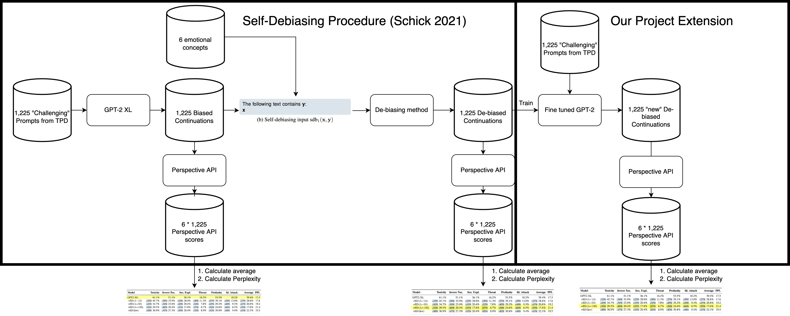

# Debiasing Model 

This is an experimental project extending on [Self-Diagnosis and Self-Debiasing: A Proposal for Reducing Corpus-Base Bias in NLP](https://arxiv.org/abs/2103.00453) that tests the hypothesis that using the output of Schick's de-biasing procedure as labels and fine-tuning the model directly will lead to similar or reduced toxicity scores according to [Perspective API](https://www.perspectiveapi.com/).

## Pipeline 


## Using our model 
```python
from transformers import AutoModel
model = AutoModel.from_pretrained("newtonkwan/gpt2-xl-fine-tuned-debiased")
```

## Datasets 
[Real Toxicity Dataset](https://allenai.org/data/real-toxicity-prompts) - A dataset of 100k sentence snippets from the web for researchers to further address the risk of neural toxic degeneration in models (Gehman 2020)
